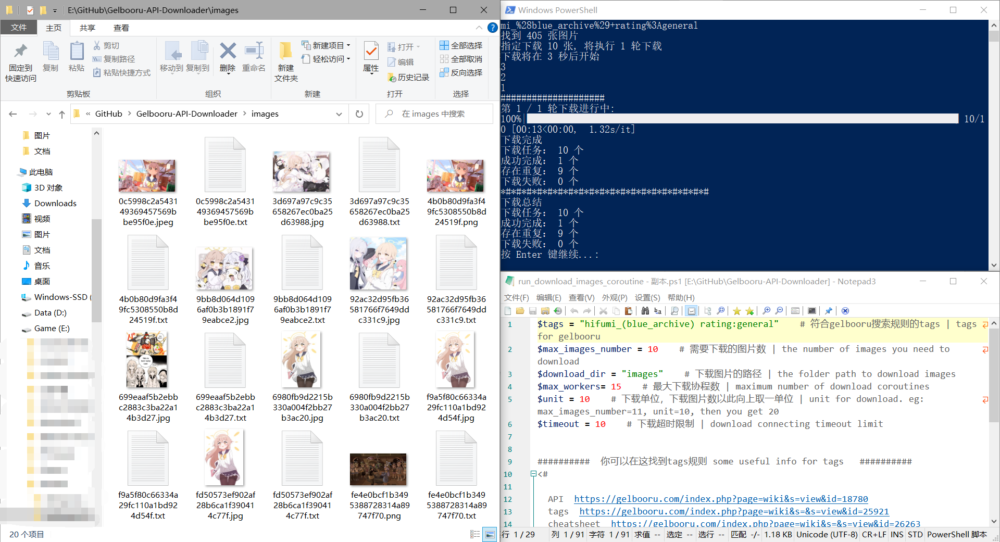
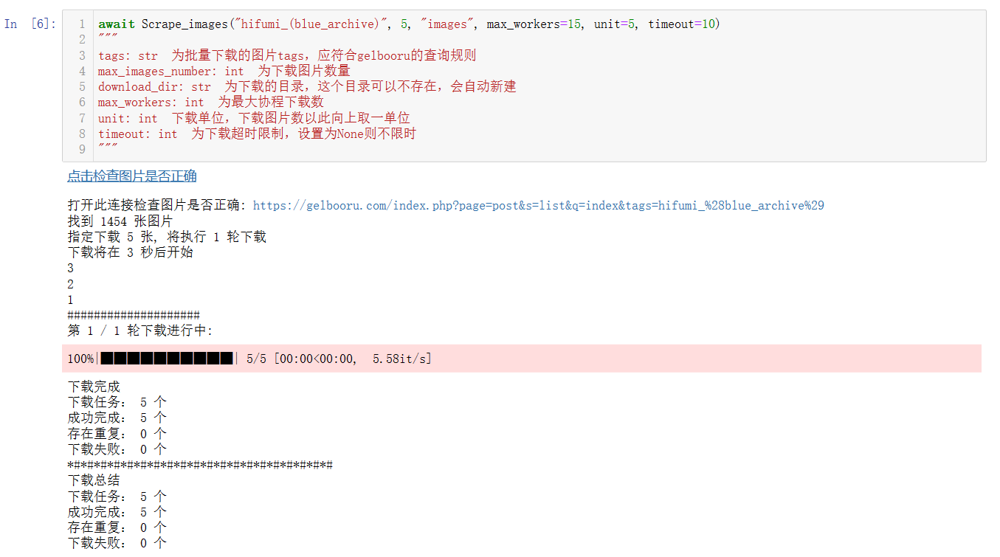
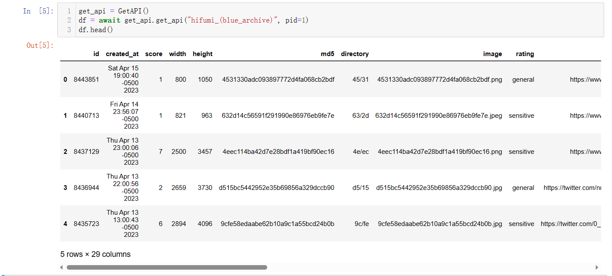

# Gelbooru-API-Downloader
A async coroutine script for gelbooru API and download.  

一个采用异步协程，用于通过指定tags关键词访问gelbooru公共API，并下载图片的脚本

对于SD训练很有用

## 现在我们有什么？
输入你想要的tags关键词，自动查询Gelbooru的API，然后采用异步协程方式，并发下载图片，同时会把gelbooru上图片的详细tags一同保存
特点：
 - Download automatically | 自动化下载
 - Download images with tag | 下载图片和tags
 - MD5, Say no to duplication | 重复文件md5校验
 - Asyncio and coroutine, fast | 协程异步并发写入和下载
 - httpx and aiofiles | 全部采用协程，不包含任何同步阻塞操作
 - Save detailed gelbooru tags txt concurrently | 下载图片同时保存详细的gelbooru tags
 - Get gelbooru tags without downloading duplicate images | 已经存在图片但无tags文本，会自动补全

### powershell一键运行


### 并发下载，（用jupyter演示）


### API查询


## Credit
### **Attention! It's probably against [Gelbooru's TOS](https://gelbooru.com/tos.php)!**

`Scrape_images` 以自动的方式，httpx默认的UA头访问gelbooru的公共API，然后并发地异步下载图片

**虽然我没找到gelbooru在这方面的限制，但这仍然可能违反了gelbooru的政策！**

**不要滥用这个脚本，不要大量下载gelbooru的图片，保证下载频率和最大协程数不要过高！**

**如果你觉得这个脚本有用，你应该感谢gelbooru的无私贡献
你可以以[捐赠或者购买商品的形式](https://buymyshit.moneygrubbingwhore.com/index.php?page=products&s=list)支持他们**

## todo
- [ ] 增加更多booru支持
- [ ] 增加对pixiv的支持
- [ ] 增加是否覆盖tags文本选项

## 安装
**请保证 `python>=3.9`**

**中国用户访问gelbooru请自行使用系统代理**

运行 `install.ps1` 完成venv虚拟环境的创建和依赖的安装
或者:
```shell
pip install -r requirements.txt
```

## 使用方式
### 脚本方式(推荐)
在windows环境中，修改 `run_download_images_coroutine.ps1` 中内容，powershell运行即可。
```shell
$tags = "hifumi_(blue_archive)"    # 符合gelbooru搜索规则的tags | tags for gelbooru
$max_images_number = 200    # 需要下载的图片数 | the number of images you need to download
$download_dir = "images"    # 下载图片的路径 | the folder path to download images
$max_workers= 15    # 最大下载协程数 | maximum number of download coroutines
$unit = 100    # 下载单位，下载图片数以此向上取一单位 | unit for download. eg: max_images_number=11, unit=10, then you get 20
$timeout = 10    # 下载超时限制 | download connecting timeout limit
```

### API方式(请用import导入此脚本)
```python
await Scrape_images(tags, max_images_number, download_dir, max_workers=max_workers, unit=unit, timeout=timeout)
"""
tags: str  为批量下载的图片tags，应符合gelbooru的查询规则
max_images_number: int  为下载图片数量
download_dir: str  为下载的目录，这个目录可以不存在，会自动新建
可选
max_workers: int  为最大协程下载数 | 默认为10
unit: int  下载单位，下载图片数以此向上取一单位 | 默认为100
timeout: int  为下载超时限制（单位秒），设置为None则不限时 | 默认为10
"""
```
**注意，只有在Ipython或者Jupyter里可以直接使用`await func()`**

**如果是在其他python环境中，需要使用`asyncion.run( func() )`**

## gelbooru tags规则
 - [API](https://gelbooru.com/index.php?page=wiki&s=view&id=18780)
 - [tags](https://gelbooru.com/index.php?page=wiki&s=&s=view&id=25921)
 - [cheatsheet](https://gelbooru.com/index.php?page=wiki&s=&s=view&id=26263)

## API

*所有的函数都采用异步协程的方式编写*

 - 2个基础类
   - `class Downloader` : 用于单个连接的文件请求，md5重复校验，tags写入
   - `class GetAPI` : 用于通过指定tags，pid页数来查询gelbooru的公共API，返回一个pandas.DataFrame
 - `async def launch_executor` : 协程池调度器，采用异步协程的方式自动调度 `class Download` 完成查询和下载
 - `async def Scrape_images` : 最顶层的封装，调用上面三个函数和类，实现指定tags和数量的图片下载

具体请查看原代码[download_images_coroutine.py](download_images_coroutine.py)

### `class GetAPI`
```python
# 实例化GetAPI类用于查询API
get_api = GetAPI()

# 异步查询API获取pandas.DataFrame
await get_api.get_api(tags, limit=100, pid=0)
"""
tags: int  为你要查询的tags字符串
可选
limit: int  为一次查询的post数，最大只能为100 | 默认为100
pid: int  为查询的第几页，如果超出最大页数则查询不到结果 | 默认为0
"""

# 成功查询会返回一个pandas.DataFrame，查询不到就返回None
```

### `class Downloader`
```python
# 实例化下载器
downloader = Downloader(timeout=None)
""" 
可选
timeout:int 为下载超时限制(单位秒)，设置为None则不限时 | 默认为None 
"""

# 异步下载文件
await downloader.download(download_dir, file_url, file_name=file_name, tags=tags, md5=md5)
"""
download_dir: str  为下载的目录，这个目录必须存在，否则报错
file_url: str  为下载直连，访问头是httpx的默认头
可选
file_name: str  指定下载名字，如果不提供，则自动取file_url的basename
tags: str  下载时会自动新建同名txt，里面写入内容为tags，如果不提供则不会新建txt
md5: str  下载时，如果存在同名文件，则会将文件与提供的md5进行对比判断是否重复，如果不提供则不校验
"""

# 下载失败就返回0； 下载成功返回1； 已有重复文件返回2
# （无论是否有重复有文件，只要提供了tags都会被重写一次）
```

### `async def launch_executor`
```python
# 这个函数会自动调度`class Downloader`实现并发下载
await launch_executor(files_df, download_dir, max_workers=10, timeout=10)
"""
files_df: pandas.DataFrame  为GetAPI查询到的pandas.DataFrame
download_dir: str  为下载的目录，这个目录必须存在，否则报错
可选
max_workers: int  为最大协程下载数 | 默认为10
timeout:int  为下载超时限制，设置为None则不限时 | 默认为10
"""
```
